# Arcade PCB cases

***Patterns to build your own Arcade PCB cases.***

Sunset Riders                         |
:------------------------------------:|
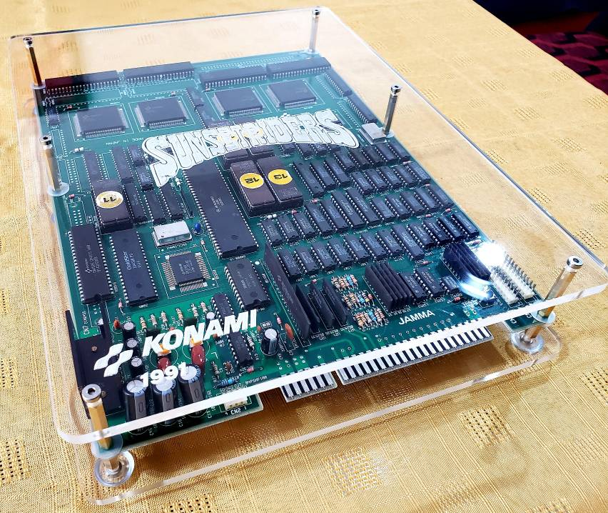|

Killer Instinct            |  Ultimate Mortal Kombat 3
:-------------------------:|:-------------------------:
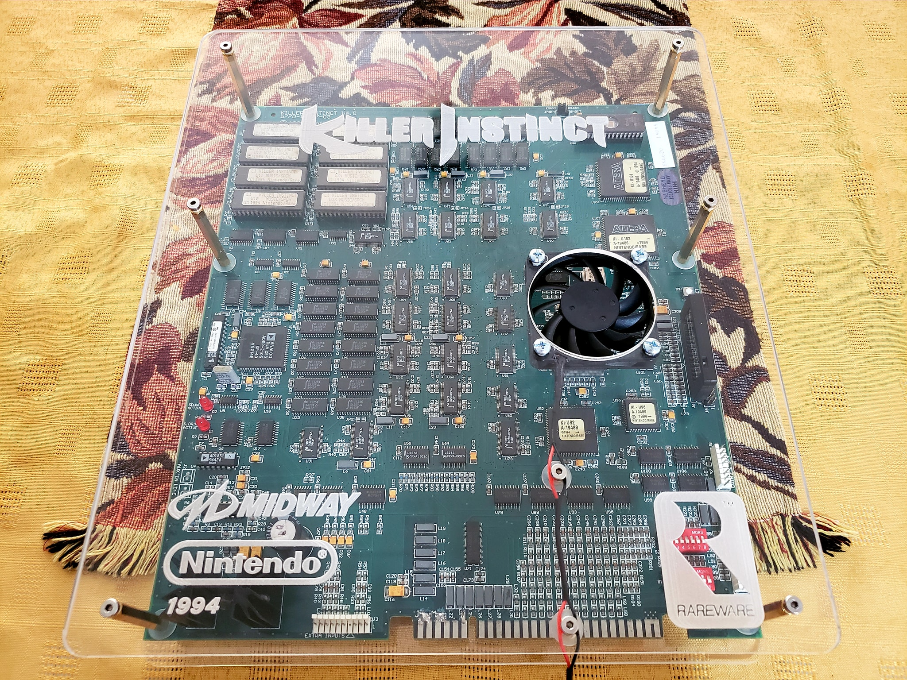  |  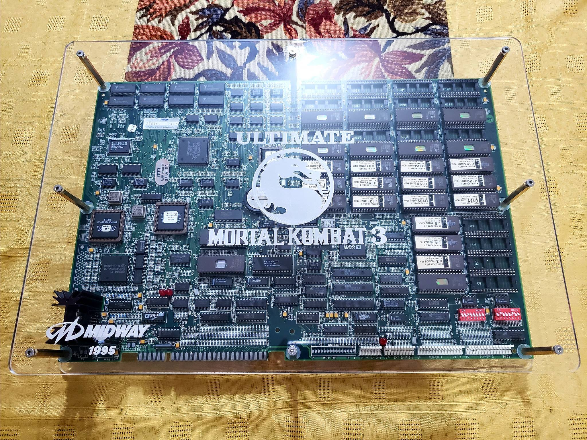

## Let's make our own case, step by step

### Step 1: Select the pattern

On the [petters forlder](https://github.com/emilianoarlettaz/arcade-pcb-case/tree/master/patterns) of this repository, you will find a subfolder containing the patterns of each available game. On each game, you must select ***only one file*** to make the case. The file you need to chose will depend on 3 factors:

* The size of the screws you are going to use to mount the case (M3 (3mm) or M4 (4mm)).
* The side of the top case where you want to engrave the logo of the game (from the outside or from the inside).
* If your game has specific PCB revisions or variations that have different sizes or hole locations. For example, CPS1 games can have the big first revision of the A Board or the little Dash A Board with the 12Mhz processor.

Based on the previous criteria, you must select the file looking at the `tags` on the filename:

#### Pattern file name labels:

- `_normal` files are for engraving the logo from the outside of the top case.
- `_reverse` files are for engraving the logo from the inside of the top case.
- `_m3` files are for M3 screw holes (3 mm).
- `_m4` files are for M4 screw holes (4 mm).
- `_cps_big` files are for CPS1 games with the big first version of A Board.
- `_cps_small` files are for CPS1 games with the later small Dash A Board.

Note that the holes to mount a fan or cooler on boards like `Killer Instinct` are always M4 (4 mm) because that is the standard for those devices.

Taking all this into account, let's suppose we want to make a case for a Sunset Riders board, using M4 screws and engraving the logo from the inside of the top case. We must choose the file `sunset_riders_reverse_m4.eps` that you can find on [this link](https://github.com/emilianoarlettaz/arcade-pcb-case/blob/master/patterns/sunset_riders/sunset_riders_reverse_m4.eps)

### Step 2: Laser cut the case

I really like how the `clear acrylic` looks for these cases because they let you see all the PCB parts and its beauty. But you can use other colors, even other material that can be cut with the laser cut machine. You can experiment with wood or metals and let me know the results to include on this documentation.

***Clear Acrylic between 4 and 6 mm of thickness is very good.***

For my first case, I used `6mm thickness clear acrylic`. It looks very well, but I think that adds too much weight to the final results. So, I moved to something more compact and lightweight. For the second iteration, I used `4mm thickness clear acrylic`. I'm very happy with the results, even for large boards like Ultimate Mortal Kombat 3.

You can buy your own material, or several laser cut stores provide their own materials. If you are going to buy the material, there is a `size.txt` file on each game folders, where you can find the size of the material you need to buy to laser cut the entire pattern for the case (top and bottom parts). This also has into account a little margin, to avoid any problems on the cutting process. For example, for Sunset Riders board, following the specifications of the [size.txt]() file, you need to buy a rectangle of Xcm x Xcm of material.

To laser cut the material, you can use your own machine or can go to a laser cut store with the pattern. The information you need to provide to the store is the following:

#### To configure the laser cut machine:

- `Black Lines` with `stroke = 0,001` are for cut.
- `Blue lines` with `stroke = 0,01` are for engrave.

If you have any doubt, show the pattern and a picture of the cases to the store employees. This is their work and they will know how to do the job. If you want to use your own machine, ***please contact me***, so I can complete this documentation with specific machine instructions.

This is the result after cutting the pattern:

Cutted Patern                         |
:------------------------------------:|
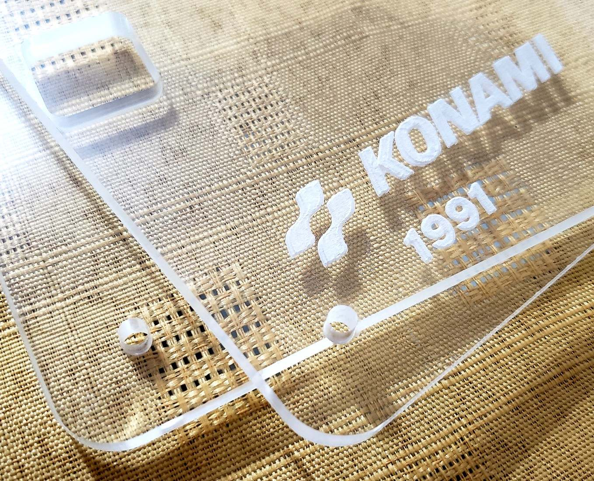|

### Step 3: Assembly the case

After laser cut and engrave the pattern, to assemble the case you will need:

#### Required for each mounting hole:

- 1x `female-female hexagonal standoff` (M3 or M4)
- 1x `male-female hexagonal standoff` (M3 or M4)
- 2x M3 or M4 `screw` (12 mm long)

#### Optional for each mounting hole:

- 2x M3 or M4 `plastic washer` (to better protect the PCB)
- 1x M3 or M4 `plastic feet` (to protect the case from scratches)

Materials for assemble each mounting hole                         |
:------------------------------------:|
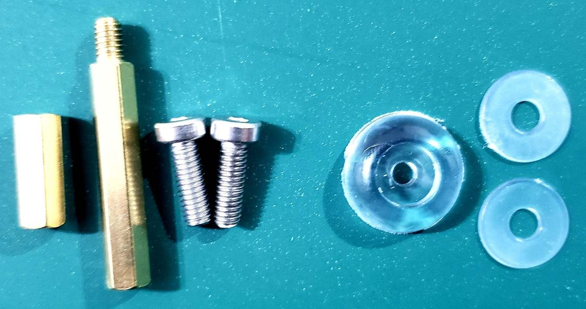|

***Before assembly the case, check if your pattern uses a cooler or fan. If it uses, check the next section to have details about how to assemble it before you mount the top part of the case.***

#### Mount the bottom case

Assemble one standoff for each mounting hole of the bottom part of the case. On each hole, first put the plastic feet from the outside using a screw. Then, place the corresponding female/female standoff from the inside of the case. Carefully, place the arcade PCB over the standoffs, aligning the standoffs with the mounting holes of the PCB. On the following pictures, you will see how this look.

Single mounting hole assebly | All bottom standoffs assembled
:-------------------------:|:-------------------------:
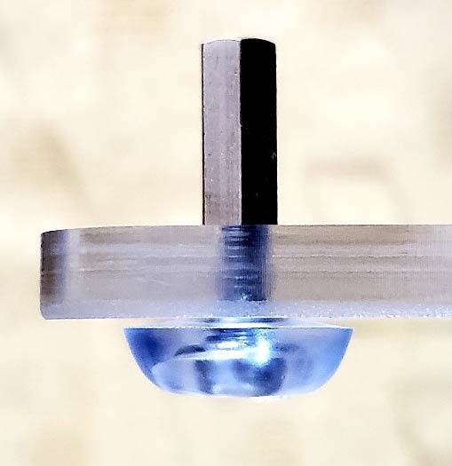  |  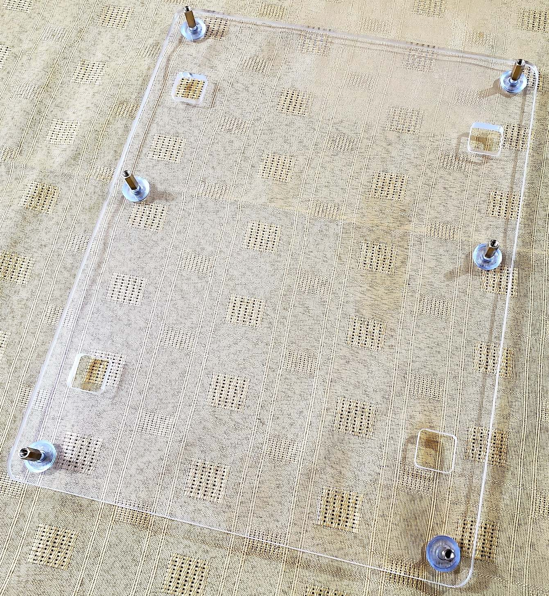

#### Mount the top case

On each mounting hole of the PCB, put a plastic washer on each side (component/part side and solder side). Then, assemble the top standoff. After all top standoffs are on place, put over them the top part of the case and adjust with the screws. On the following pictures, you will see how this look.

Plastic washers on the PBC mounting hole | Top standoff on place
:-------------------------:|:-------------------------:
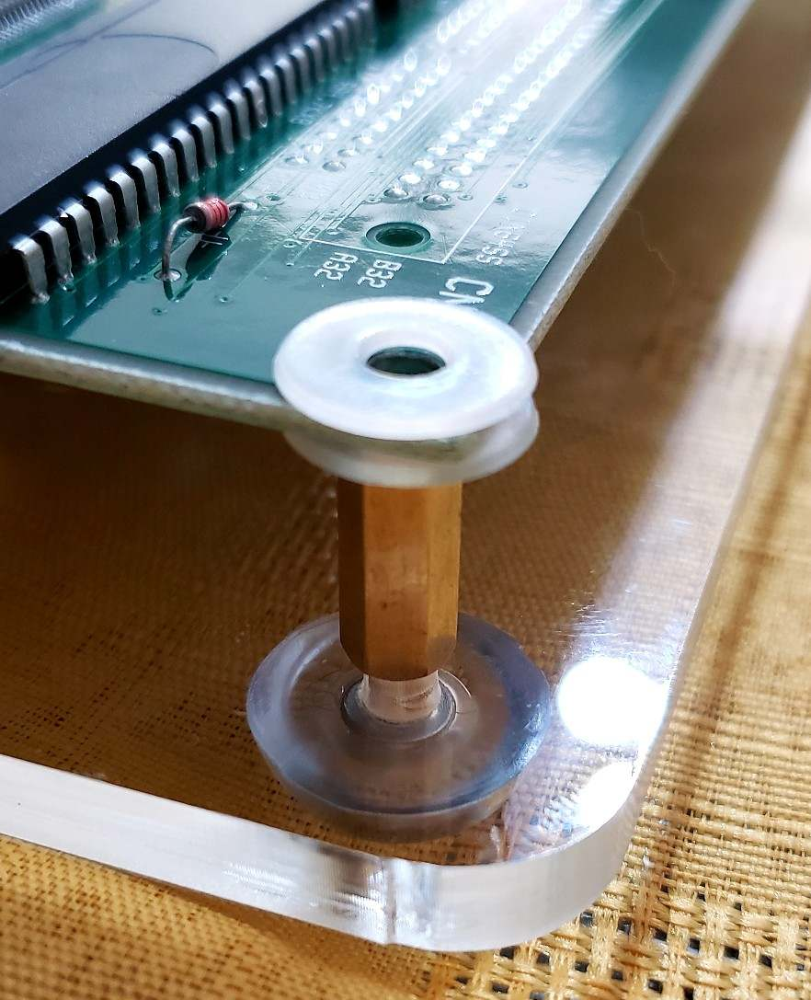  |  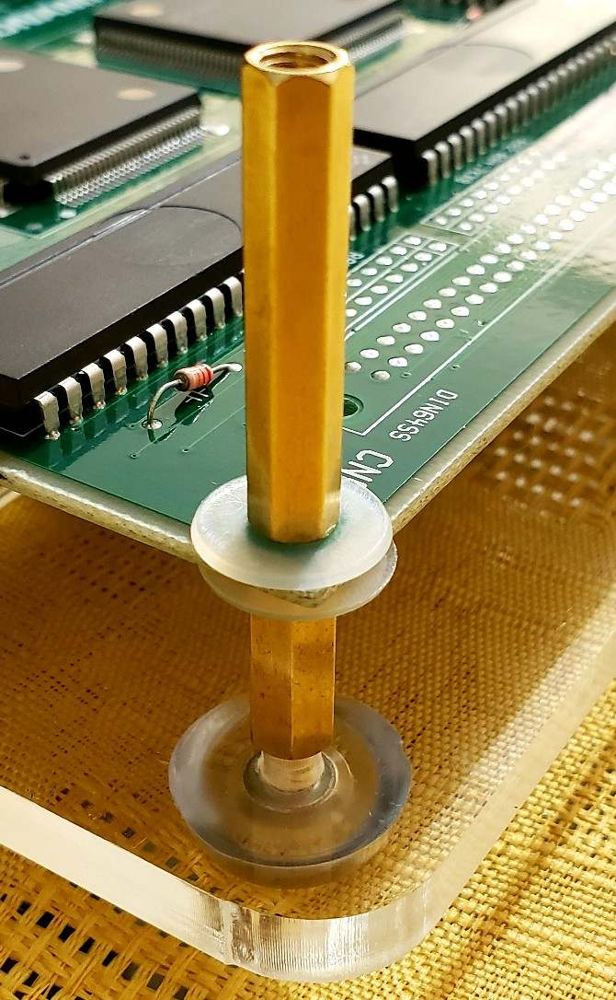

Top case part on place | Final result
:-------------------------:|:-------------------------:
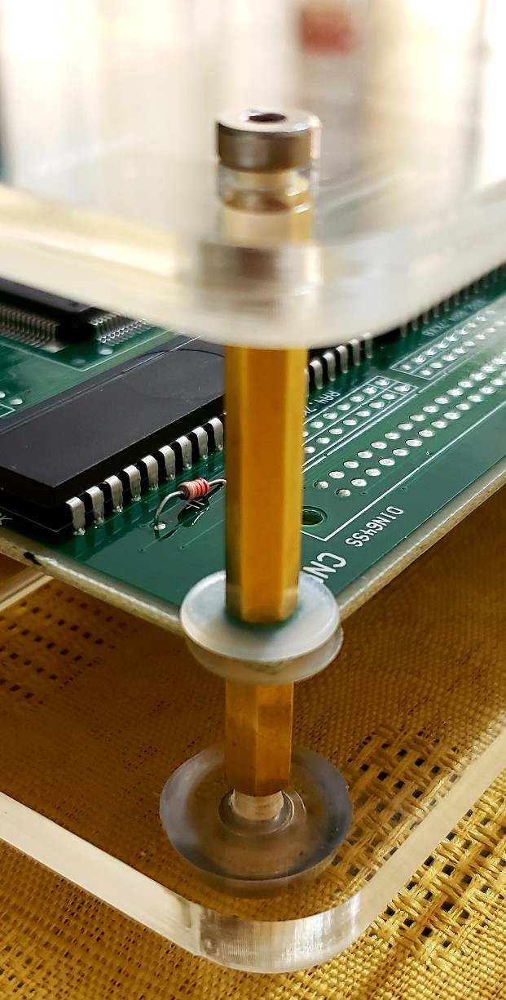  |  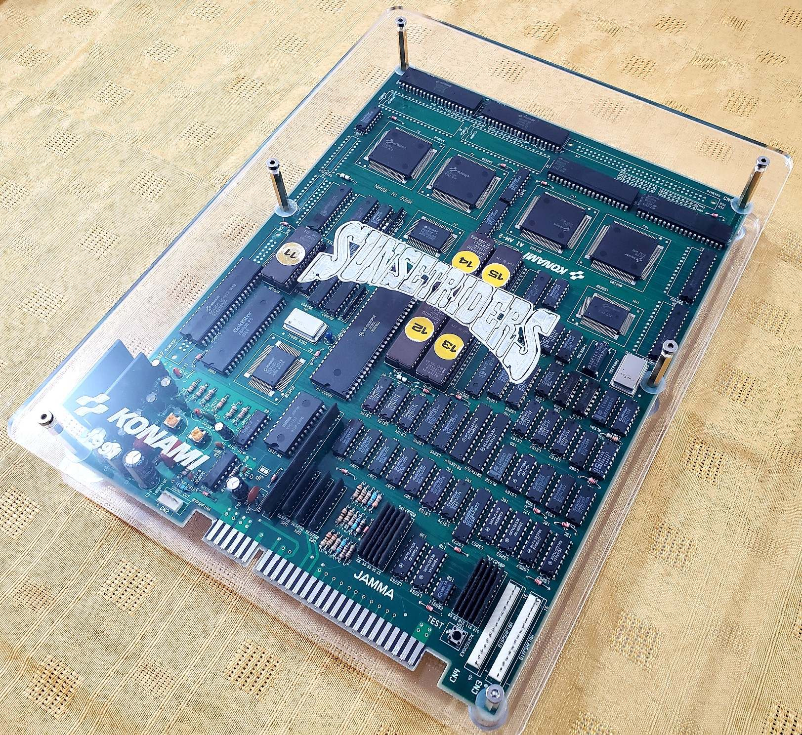
