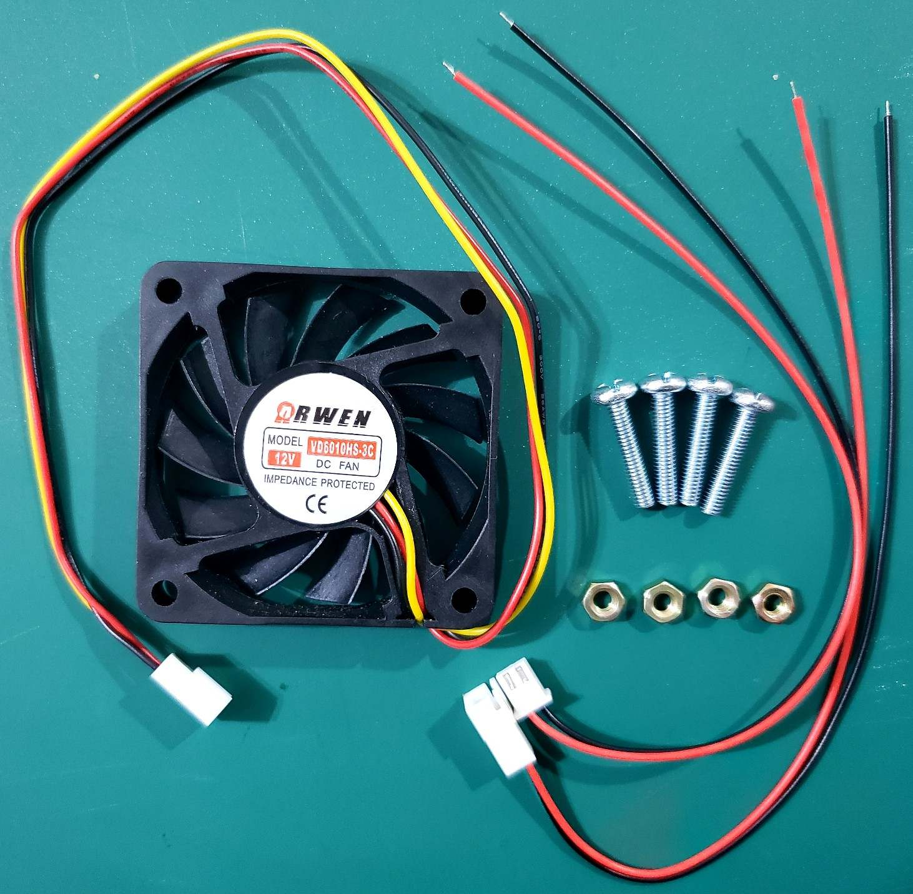
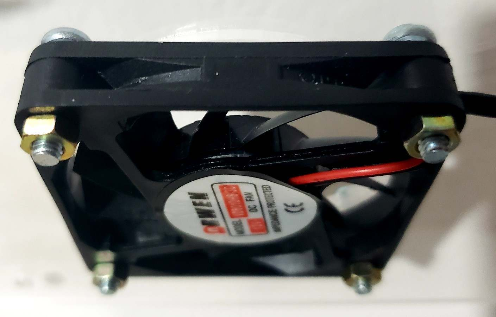
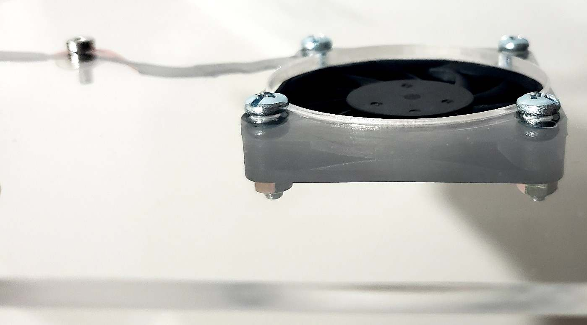
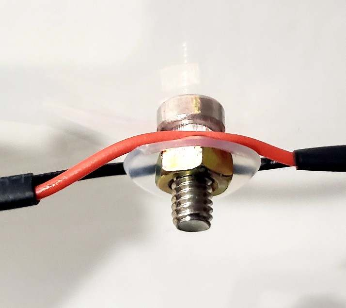

# Arcade PCB cases

***Plans to build your own Arcade PCB cases.***

Sunset Riders                         |
:------------------------------------:|
|

Killer Instinct            |  Ultimate Mortal Kombat 3
:-------------------------:|:-------------------------:
  |  

## Let's make our own case, step by step

### Step 1: Select the plan

On the [games forlder](https://github.com/emilianoarlettaz/arcade-pcb-case/tree/master/games) of this repository, you will find a subfolder containing the plans of each available game. On each game, you must select ***only one file*** to make the case. The file you need to chose will depend on 3 factors:

* The size of the screws you are going to use to mount the case (M3 (3mm) or M4 (4mm)).
* The side of the top case where you want to engrave the logo of the game (from the outside or from the inside).
* If your game has specific PCB revisions or variations that have different sizes or hole locations. For example, Capcom CPS1 games can have the big first revision of the A Board or the little Dash A Board with the 12Mhz processor.

Based on the previous criteria, you must select the file looking at the `tags` on the filename:

#### Plans file name labels:

- `_normal` files are for engraving the logo from the outside of the top case.
- `_reverse` files are for engraving the logo from the inside of the top case.
- `_m3` files are for M3 screw holes (3mm).
- `_m4` files are for M4 screw holes (4mm).
- `_cps_big` files are for Capcom CPS1 games with the big first version of A Board.
- `_cps_small` files are for Capcom CPS1 games with the later small Dash A Board.

Note that the holes to mount a fan or cooler on boards like `Killer Instinct` are always M4 (4mm) because that is the standard for those devices.

Taking all this into account, let's suppose we want to make a case for a Sunset Riders board, using M4 screws and engraving the logo from the inside of the top case. We must choose the file `sunset_riders_reverse_m4.eps` that you can find on [this link](https://github.com/emilianoarlettaz/arcade-pcb-case/blob/master/games/sunset_riders/sunset_riders_reverse_m4.eps)

### Step 2: Laser cut the case

I really like how the `clear acrylic` looks for these cases because they let you see all the PCB parts and its beauty. But you can use other colors, even other material that can be cut with the laser cut machine. You can experiment with wood or metals and let me know the results to include on this documentation.

***Clear Acrylic between 4mm and 6mm of thickness is very good.***

For my first case, I used `6mm thickness clear acrylic`. It looks very well, but I think that adds too much weight to the final results. So, I moved to something more compact and lightweight. For the second iteration, I used `4mm thickness clear acrylic`. I'm very happy with the results, even for large boards like Ultimate Mortal Kombat 3.

You can buy your own material, or several laser cut stores provide their own materials. If you are going to buy the material, there is a `size.txt` file on each game folder, where you can find the size of the material you need to buy to laser cut the entire plan for the case (top and bottom parts). This also has into account a little margin, to avoid any problems on the cutting process. For example, for Sunset Riders board, following the specifications of the [size.txt](https://github.com/emilianoarlettaz/arcade-pcb-case/blob/master/games/sunset_riders/size.txt) file, you need to buy a rectangle of 34cm x 52cm of material.

To laser cut the material, you can use your own machine or can go to a laser cut store with the plan. The information you need to provide to the store is the following:

#### To configure the laser cut machine:

- `Black Lines` with `stroke = 0,001` are for cut.
- `Blue lines` with `stroke = 0,01` are for engrave.

If you have any doubt, show the pattern and a picture of the cases to the store employees. This is their job and they will know how to do it. If you want to use your own machine, ***please contact me***, so I can complete this documentation with specific machine instructions.

This is the result after cutting the plan:

Cutted Plan                         |
:------------------------------------:|
|

### Step 3: Assembly the case

After laser cut and engrave the plan, to assemble the case you will need:

#### Required for each mounting hole:

- 1x `female-female standoff` (M3 or M4)
- 1x `male-female standoff` (M3 or M4)
- 2x M3 or M4 `screw` (8mm to 12mm long)

#### Optional for each mounting hole:

- 2x M3 or M4 `plastic washer` (to better protect the PCB)
- 1x M3 or M4 `plastic feet` (to protect the case from scratches)

Materials for assemble each mounting hole                         |
:------------------------------------:|
|

***Before assembly the case, check if your plan uses a cooler or fan. If it uses, check the next section to have details about how to assemble it before you mount the top part of the case.***

#### Mount the bottom case

Assemble one standoff for each mounting hole of the bottom part of the case. On each hole, first put the plastic feet from the outside using a screw. Then, place the corresponding female/female standoff from the inside of the case. Carefully, place the arcade PCB over the standoffs, aligning the standoffs with the mounting holes of the PCB. On the following pictures, you will see how this look.

Single mounting hole assebly | All bottom standoffs assembled
:-------------------------:|:-------------------------:
  |  

#### Mount the top case

On each mounting hole of the PCB, put a plastic washer on each side (component/part side and solder side). Then, assemble the top standoff. After all top standoffs are on place, put over them the top part of the case and adjust with the screws. On the following pictures, you will see how this look.

Plastic washers on the PBC mounting hole | Top standoff on place
:-------------------------:|:-------------------------:
  |  

Top case part on place | Final result
:-------------------------:|:-------------------------:
  |  

### Additional Step: Assembly the cooler

Some games like Killer Instinct are known for having a heat problem. By adding a cooler over the CPU, mounted on the case, we can dramatically reduce the operating temperature of the device. This is intended to increase the life of the board. To mount a cooler on this kind of games, you will need the following materials:

#### Required materials to mount the cooler:

- 1x `cooler of fan` of 60mm x 60mm size (12 or 5 Volts).
- 4x `M4 screws (4mm)` long enough to pass throw the cooler and the top case (20 mm at least).
- 4x `M4 nuts (4mm)` to adjust the screws from the interior side of the top case.
- 1x `2 pins male connector with wire`.
- 1x `2 pins female connector with wire`.

Materials for assemble the cooler or fan                         |
:------------------------------------:|
|

#### Mount the cooler or fan

If the cooler or fan you bought have 3 wires, just `ignore the yellow one`. You can even cut it. 

Solder the `2 pins connector to the red and black wires of the cooler`. Make sure you the wire to the connector is long enough to reach the end of the case from the processor area.

For 12 Volts cooler, solder the red wire of the female 2 pins connector to the `12 Volts line of Jamma harness` (pins 6 or F).

For 5 Volts cooler, solder the red wire of the female 2 pins connector to the `5 Volts line of Jamma harness` (pins 3, 4, C or D).

On both cases, solder the black wire of the 2 pins female connector to the `Ground line of Jamma harness` (pins 1, 2, 27, 28, A, B, e or f).

In all cases you have to solder the wire to only one of the corresponding pins, there is no need of solder to all points. Usually they are already join at some point.

Align the cooler with the corresponding mounting hole over the PCB processor from the interior side of the top case. Make sure that the side of the cooler with the brand logo and some spects like the voltaje, is facing down towars the processor. This will ensure that the wind hits the CPU, cooling it.

Use the 4 screws and the 4 nuts to fix the cooler on the top case. Aditionally, you can use 2 more screws and 2 more nuts to fix the rest of the wire from the cooler to the outside of the case, using the extra holes provided for that.

Every time you connect the Jamma harness to the board, make sure you also connect the cooler with the 2 pins connectors we added.

On the following pictures, you can see the final results:

Cooler on top case from the inside | Cooler on top case from the outside
:-------------------------:|:-------------------------:
  |  

Additional wire mounting              |
:------------------------------------:|
|